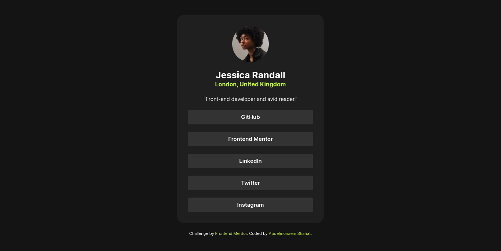

# Frontend Mentor - Social links profile solution

This is a solution to the [Social links profile challenge on Frontend Mentor](https://www.frontendmentor.io/challenges/social-links-profile-UG32l9m6dQ). Frontend Mentor challenges help you improve your coding skills by building realistic projects.

## Table of contents

- [Overview](#overview)
  - [The challenge](#the-challenge)
  - [Screenshot](#screenshot)
  - [Links](#links)
- [My process](#my-process)
  - [Built with](#built-with)
  - [What I learned](#what-i-learned)
  - [Continued development](#continued-development)
- [Author](#author)

## Overview

### The challenge

Users should be able to:

- See hover and focus states for all interactive elements on the page

### Screenshot



### Links

- Solution URL: [frontendmentor solution URL](https://your-solution-url.com)
- Live Site URL: [challenge live site URL on Github Pages](https://your-live-site-url.com)

## My process

### Built with

- Semantic HTML5 markup
- CSS custom properties
- Flexbox
- CSS Grid
- Mobile-first workflow

### What I learned

here the code I most proud on this challenge

```html
<footer class="card-footer" aria-label="Jessica Randall's social media links">
  <ul class="author-socials" role="list">
    <li class="author-socials-item">
      <a href="!#" rel="noopener noreferrer" target="_blank">GitHub</a>
    </li>
    <li class="author-socials-item">
      <a href="!#" rel="noopener noreferrer" target="_blank">Frontend Mentor</a>
    </li>
    <li class="author-socials-item">
      <a href="!#" rel="noopener noreferrer" target="_blank">LinkedIn</a>
    </li>
    <li class="author-socials-item">
      <a href="!#" rel="noopener noreferrer" target="_blank">Twitter</a>
    </li>
    <li class="author-socials-item">
      <a href="!#" rel="noopener noreferrer" target="_blank">Instagram</a>
    </li>
  </ul>
</footer>
```

```css
@media (37.5rem < width) {
  .card {
    max-width: 40rem;
    width: 100%;
    padding: 3rem;
    border-radius: 2rem;
  }
  .card-img {
    width: 10rem;
    height: 10rem;
  }
}
```

### Continued development

I will continue challenge myself to improve my skills and add new techs to the next challenges.

## Author

- Website - [my portfolio](https://abdelmonaem-portfolio.vercel.app/)
- Frontend Mentor - [@coder-abdo](https://www.frontendmentor.io/profile/coder-abdo)
- LinkedIn - [abdelmonaem](https://www.linkedin.com/in/abdelmonaem-shahat/)
- github - [@coder-abdo](https://github.com/coder-abdo)
